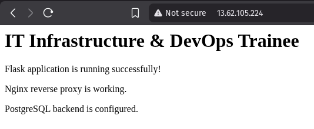
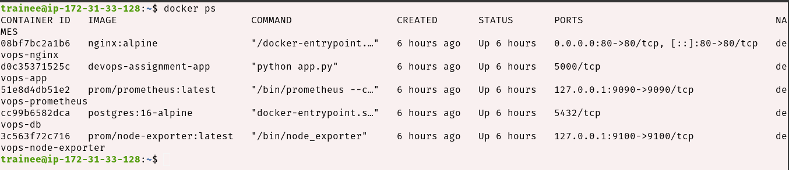
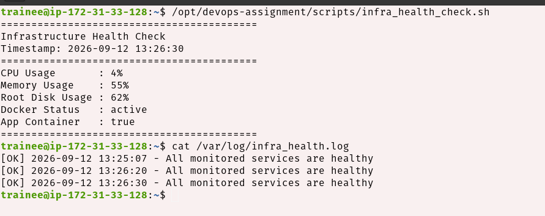
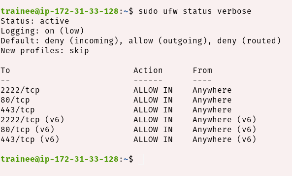

# IT Infrastructure & DevOps Trainee – Practical Implementation

A practical DevOps and IT infrastructure implementation completed as part of the **IT Infrastructure & DevOps Trainee practical assignment**.

The project demonstrates Linux server hardening, Docker containerization, multi-container networking, Nginx reverse proxy, PostgreSQL, Prometheus monitoring, Bash automation, database backup and recovery, firewall configuration, and Git-based configuration management.

---

## 1. Project Overview

This project was implemented on an **Ubuntu EC2 instance** and follows a production-oriented infrastructure approach.

### Technologies Used

* **AWS EC2**
* **Ubuntu Linux**
* **SSH**
* **UFW Firewall**
* **Docker**
* **Docker Compose**
* **Nginx**
* **Python / Flask**
* **PostgreSQL**
* **Prometheus**
* **Node Exporter**
* **Bash**
* **Cron**
* **Git & GitHub**

---

## 2. Architecture

```text
                         Internet
                            |
                            | HTTP :80
                            v
                    +----------------+
                    |      Nginx     |
                    | Reverse Proxy  |
                    +-------+--------+
                            |
                            | Docker Network
                            v
                    +----------------+
                    |  Flask App     |
                    |    :5000       |
                    +-------+--------+
                            |
                            | Backend Network
                            v
                    +----------------+
                    |   PostgreSQL   |
                    |     :5432      |
                    +----------------+

              Monitoring Network
                     |
          +----------+----------+
          |                     |
          v                     v
  +---------------+     +---------------+
  | Node Exporter | --> |  Prometheus   |
  |     :9100     |     |     :9090     |
  +---------------+     +---------------+
```

The Flask application and PostgreSQL database are not directly exposed to the Internet.

Only Nginx exposes port `80` publicly.

---

# 3. Security Configuration

The EC2 instance was hardened using the following configuration:

* SSH moved from port `22` to `2222`
* Root SSH login disabled
* SSH key-based authentication enabled
* UFW configured with default-deny incoming policy
* HTTP `80/tcp` allowed
* HTTPS `443/tcp` allowed
* SSH `2222/tcp` restricted to the authorized source IP
* Application port `5000` kept internal
* PostgreSQL port `5432` kept internal
* Prometheus and Node Exporter bound to localhost
* Application container runs as a non-root user
* Database credentials stored in `.env`
* `.env` excluded from Git using `.gitignore`

---

# 4. Repository Structure

```text
devops-infrastructure-assignment/
│
├── app/
│   ├── app.py
│   ├── Dockerfile
│   └── requirements.txt
│
├── nginx/
│   └── nginx.conf
│
├── monitoring/
│   └── prometheus.yml
│
├── scripts/
│   ├── infra_health_check.sh
│   └── db_backup.sh
│
├── screenshots/
│   ├── 01-ufw-status.png
│   ├── 02-docker-ps.png
│   ├── 03-reverse-proxy.png
│   └── 04-health-check.png
│
├── docker-compose.yml
├── .env
├── .gitignore
└── README.md
```

---

# 5. Prerequisites

The server should have the following installed:

```bash
docker --version
docker compose version
git --version
ufw --version
```

Verify Docker:

```bash
sudo systemctl status docker
```

---

# 6. Initial Setup

Clone the repository:

```bash
git clone git@github.com:avinash01123/devops-infrastructure-assignment.git
```

Enter the project directory:

```bash
cd devops-infrastructure-assignment
```

Create the environment file:

```bash
nano .env
```

Example:

```env
POSTGRES_DB=devopsdb
POSTGRES_USER=devops
POSTGRES_PASSWORD=your-strong-password
```

The `.env` file must not be committed to Git.

---

# 7. Configure the Firewall

Check the current firewall status:

```bash
sudo ufw status verbose
```

Expected configuration:

```text
Status: active
Default: deny (incoming), allow (outgoing)

2222/tcp    ALLOW
80/tcp      ALLOW
443/tcp     ALLOW
```

Enable UFW if required:

```bash
sudo ufw enable
```

Verify again:

```bash
sudo ufw status verbose
```

---

# 8. Start the Application

Build and start all services:

```bash
docker compose up -d --build
```

Check the running containers:

```bash
docker ps
```

Expected services include:

```text
devops-nginx
devops-app
devops-db
devops-node-exporter
devops-prometheus
```

Check Compose status:

```bash
docker compose ps
```

---

# 9. Verify the Application

Test the reverse proxy locally:

```bash
curl http://localhost/
```

Health endpoint:

```bash
curl http://localhost/health
```

Database connectivity:

```bash
curl http://localhost/db-test
```

The request flow is:

```text
Client
  |
  v
Nginx :80
  |
  v
Flask Application :5000
  |
  v
PostgreSQL :5432
```

The Flask application and PostgreSQL ports are not directly exposed to the Internet.

---

# 10. Verify Reverse Proxy Routing

Check that Nginx is listening on port 80:

```bash
sudo ss -tlnp | grep ':80'
```

Verify that the application is accessible through Nginx:

```bash
curl http://localhost/
```

From a browser, open:

```text
http://<EC2-PUBLIC-IP>/
```

The request should be handled by Nginx and forwarded to the Flask application.

### Reverse Proxy Screenshot



---

# 11. Verify Running Containers

Run:

```bash
docker ps
```

This confirms that the required containers are running.

### Docker Screenshot



---

# 12. Infrastructure Health Check

The project includes a Bash health-check script:

```bash
/opt/devops-assignment/scripts/infra_health_check.sh
```

The script checks:

* CPU usage
* Memory usage
* Root disk usage
* Docker service status
* Application container status

Run it manually:

```bash
sudo /opt/devops-assignment/scripts/infra_health_check.sh
```

A successful execution should report:

```text
Infrastructure Health Check
CPU Usage       : XX%
Memory Usage    : XX%
Root Disk Usage : XX%
Docker Status   : active
App Container   : true

[OK] YYYY-MM-DD HH:MM:SS - All monitored services are healthy
```

View the health-check log:

```bash
cat /var/log/infra_health.log
```

The script is also scheduled using Cron:

```cron
*/15 * * * * /opt/scripts/infra_health_check.sh
```

This runs the health check every 15 minutes.

### Health Check Screenshot



---

# 13. Database Backup

The database backup script is:

```bash
scripts/db_backup.sh
```

Run the backup manually:

```bash
sudo /opt/devops-assignment/scripts/db_backup.sh
```

Backups are stored in:

```text
/var/backups/db/
```

List available backups:

```bash
ls -lh /var/backups/db/
```

The backup is compressed using gzip:

```text
db_backup_YYYYMMDD.sql.gz
```

Verify a backup:

```bash
gzip -t /var/backups/db/db_backup_YYYYMMDD.sql.gz
```

---

# 14. Database Restore

Create a temporary restore database:

```bash
docker exec -it devops-db \
psql -U devops -c "CREATE DATABASE restore_test;"
```

Restore the backup:

```bash
gunzip -c /var/backups/db/db_backup_YYYYMMDD.sql.gz | \
docker exec -i devops-db \
psql -U devops -d restore_test
```

Verify the restored database:

```bash
docker exec -it devops-db \
psql -U devops -d restore_test
```

After verification, the temporary database can be removed:

```bash
docker exec -it devops-db \
psql -U devops -c "DROP DATABASE restore_test;"
```

---

# 15. Monitoring

Prometheus and Node Exporter are included in the Docker Compose configuration.

Check containers:

```bash
docker ps
```

Check Prometheus:

```bash
curl http://localhost:9090/-/healthy
```

Check Node Exporter:

```bash
curl http://localhost:9100/metrics
```

Prometheus scrapes Node Exporter every 15 seconds.

Monitoring ports are bound to localhost rather than being publicly exposed.

---

# 16. Useful Verification Commands

### Firewall

```bash
sudo ufw status verbose
```

### Docker containers

```bash
docker ps
```

### All Compose services

```bash
docker compose ps
```

### Application logs

```bash
docker logs devops-app
```

### Nginx logs

```bash
docker logs devops-nginx
```

### PostgreSQL logs

```bash
docker logs devops-db
```

### Reverse proxy test

```bash
curl http://localhost/
```

### Application health

```bash
curl http://localhost/health
```

### Database test

```bash
curl http://localhost/db-test
```

### Health-check log

```bash
cat /var/log/infra_health.log
```

---

# 17. Teardown

To stop the application while keeping the containers:

```bash
docker compose stop
```

To stop and remove the containers and network:

```bash
docker compose down
```

To rebuild the application:

```bash
docker compose down
docker compose up -d --build
```

To remove containers and project volumes:

```bash
docker compose down -v
```

> **Warning:** `docker compose down -v` removes the PostgreSQL Docker volume and therefore deletes the database data stored in that volume. Use this only when a complete reset is intended.

---

# 18. Git Branching Strategy

The project uses feature branches to keep configuration changes organized.

### Main branches

```text
main
│
├── feature/docker-setup
│
└── feature/screenshots
```

Feature branches were used for implementation before merging completed work into `main`.

Example workflow:

```bash
git checkout -b feature/example
```

Make changes and commit:

```bash
git add .
git commit -m "feat: describe the implemented change"
```

Push the feature branch:

```bash
git push -u origin feature/example
```

Merge into main:

```bash
git checkout main
git merge --no-ff feature/example
git push origin main
```

---

# 19. Screenshots

## Firewall Status

The UFW firewall was verified using:

```bash
sudo ufw status verbose
```



---

## Running Containers

Docker services were verified using:

```bash
docker ps
```


---

## Reverse Proxy Application

The application was accessed through the Nginx reverse proxy from a browser.


---

## Infrastructure Health Check

The health-check script was successfully executed and the generated log output was verified.


---

# 20. Final Verification Checklist

Before considering the implementation complete:

* [x] EC2 Ubuntu server configured
* [x] SSH hardened
* [x] Root SSH login disabled
* [x] UFW firewall configured
* [x] Docker installed and configured
* [x] Flask application containerized
* [x] PostgreSQL container configured
* [x] Docker networks configured
* [x] Nginx reverse proxy configured
* [x] Application accessible through Nginx
* [x] Prometheus configured
* [x] Node Exporter configured
* [x] Bash health-check script implemented
* [x] Cron health monitoring configured
* [x] PostgreSQL backup implemented
* [x] Database restore tested
* [x] Git feature branches used
* [x] Changes merged into `main`
* [x] Verification screenshots added
* [x] README mini-runbook completed

---

# 21. Conclusion

This assignment provided practical experience in designing and implementing a secure Linux-based infrastructure environment.

The implementation covers the complete flow from **server security and networking to containerization, reverse proxying, monitoring, automation, backup/recovery, and Git-based infrastructure management**.

The project demonstrates practical understanding of DevOps workflows, Linux administration, Docker networking, infrastructure security, automation, and operational troubleshooting.

